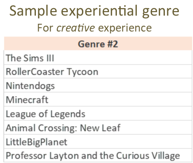
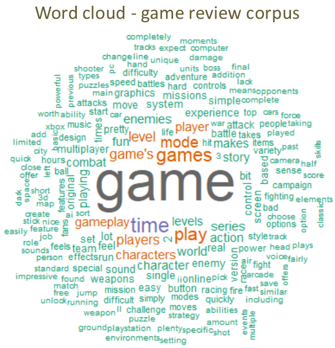
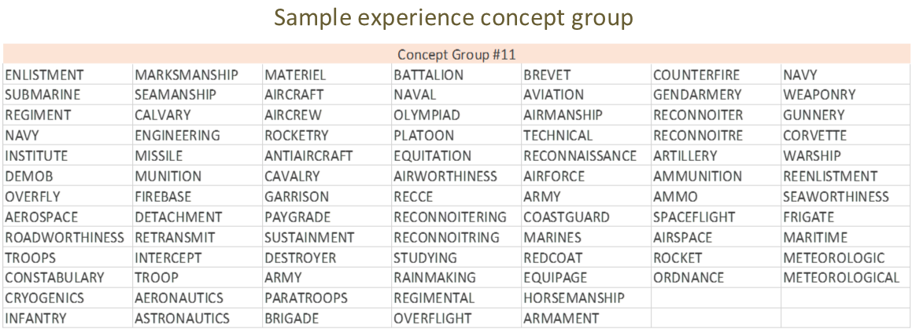
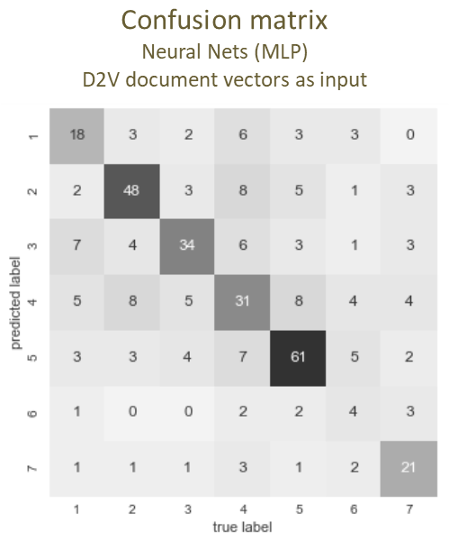
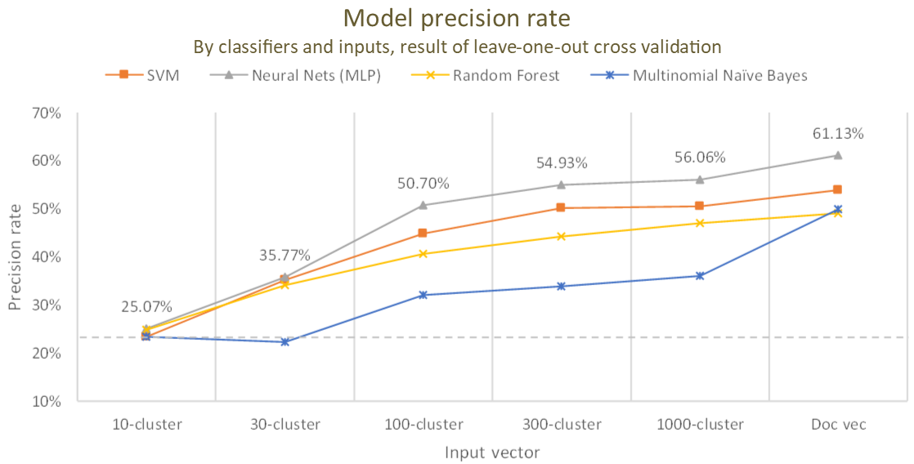
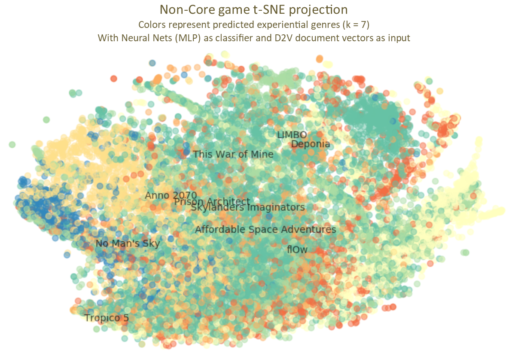
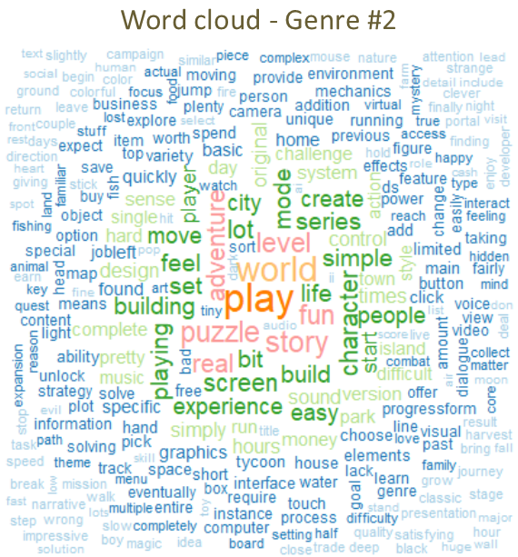
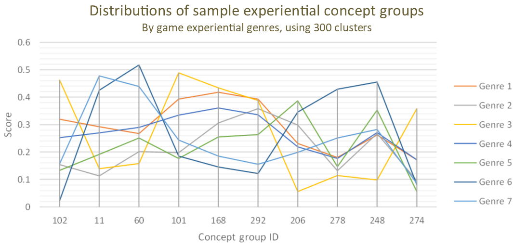

How can subjective experiences be logically portrayed? For experience-intensive products, such as video games, where graphic quality, game specifications, and traditional metrics are deficient in illustrating the diverse gaming experiences players seek for. Game genres (first-person shooters, role-playing, puzzles, etc.) may serve as one simplistic manner of categorizing video games. However, they capture only a superficial form of the gameplay and are hardly indicative of the rich depth of in-game experiences that one may be exposed to as a player. In this research, I propose a new analytical scheme that describes product experiences through critique reviews, with a classification model employing video games and their review articles as a demonstration. This scheme combines a survey and computational content analyses to provide quality measures of abstract product experiences in an objective and cost-effective way.

 

---------------

## Method
In this research, I present ways of acquiring experience descriptions, product experiential genres and experience features, from expert review texts.

Efficacy of these experience descriptions is attested via an operative classification model, demonstrated with video game products and a corresponding review corpus. To start with, real experiential genres of a selection of video games are identified as response variable of the classification model through a survey of real video game players. Meanwhile, experience features of each of the selected games are addressed in the expert review texts as the predictor variables by a sequence of computational content analysis. Finally, these experience features are applied with four different classifiers to predict the real experiential genres of the selected games. Successful prediction of the experiential genres evinces the connection between them and the review texts. This vouches for the effectiveness of the experience features and genres identified from the review texts in describing the real product experiences revealed in the survey.

 

### Response Variable—Experiential Genre
Experiential genres are game categories premised upon experience delivered in the games. Identifying those genres, a survey is conducted with 50 core games, hand-picked popular titles, through Amazon Mechanical Turk (MTurk). With 350 participants, it collects 6,990 experiential resemblances in a triplet form—the relative similarity of game A to B and to C.

These triplet-resemblances are built into a 25-dimensional space via the t-Distributed Stochastic Triplet Embedding (t-STE), where distances between each game preserve the similarity of the games’ experiences. Based on where they locate in this embedding space, the core games are clustered into seven groups by the Ward algorithm, each denoting one potential video game experiential genre, that later serves as an outcome variable in the classification model.

{width=80%}

For example, Genre #2 includes traditional simulation games, as well as several MOBA and puzzle games, all requiring their players to *explore* and to be *creative* to succeed.

{width=26.5%}

 

### Predictor Variable—Experience Feature
Game experience features are specific experiences delivered in a game. In this study, they are extracted from an expert review corpus, compiled from articles of three major game information websites, *GameSpot*, *GamesRadar*, and *Polygon*. The corpus includes 15,727 English reviews, covering 11,724 unique games in the last four decades, and amasses a total of 15-million words of analysis. A word cloud is provided, showing high-frequency terms of this corpus. It is then applied with the Word2Vec (W2V) algorithm to provide a 300-dimensional space that representing semantic similarities between words apropos of linguistic conventions of the video gaming field.

{width=40%}

Based on this embedding space, two approaches are adopted in acquiring the features. One utilizes the Doc2Vec (D2V) algorithm to acquire document vectors, each denotes the semantic position of a review article in the W2V space. Out of the vectors, the value of each dimension is taken as an experience feature of the corresponding game. Another employs a document’s cosine similarity, in the W2V space, of each “experience concept group” as the feature.  The concept groups are clusters of 30,396 experience keywords, identified through reversed searches of Webster Unabridged Dictionary and expanded by the WordNet synsets. The keywords are clustered with the Ward algorithm into 10, 30, 100, 300, and 1000 concept groups, by their semantic meaning revealed through the Google News W2V space.

For example, Concept Group #11 (of the 300 clusters) contains a particular experience of military, as the keywords include not only types of armed forces but also actions, equipment, and facilities commonly associated with the troops.

{width=80%}

 

### Classification Model
Regarding the 50 core games, I extract experience features from 355 review articles in predicting the games’ experiential genres with multiple classification models. Both approaches of the experience features are applied with four classifiers: Support Vector Machine (SVM, with the linear kernel), Neural Nets (Multi-Layer Perceptron (MLP), with 100 hidden layers), Random Forest, and Multinomial Naïve Bayes. Of all combinations, model precision rates are evaluated under the leave-one-out cross validation.

{width=32%}

{width=80%}

Among all models, the Neural Nets performs the best, with the document vectors as the input, topping a 61.13% precision rate (see confusion matrix for genre breakdown), a substantial improvement from the baseline of 23.38%.

This best model is then applied with the full 15,727 game reviews in the expert review corpus. This effectively estimates experiential genres for the 11-thousand non-core games. The results are projected with t-Distributed Stochastic Neighbor Embedding (t-SNE). In the projection, I mark random games from Genre #2 (turquoise color). They closely echo the *explorative* and *creative* experience represented by the core games of this genre. From the geographical separation of the colors, we also gain superficial insights to the quality of the underlying model—it successfully captures the between-genre variation as shown by the observations’ projected locations.

{width=80%}

 

---------------

## Portrait of the Experience
We might describe the experience of a game with measures developed in this study, the experiential genres, concept groups, and individual keywords. For example, by observing high-frequency keywords, we may savor the flavor of a genre. As for Genre #2, we have keywords like CREATE, WORLD, BUILD, and LIFE for the creativity-intensive games.

{width=40%}

We may also take advantage of a hierarchical structure among the measures—the genres can be portrayed with the concept groups, which are, in turn, impersonated by the individual keywords. For example, we could describe a genre via its scores (average cosine similarity) on particular concept groups. In the below figure, Genre #2 has the lowest score, among all genres, on Concept Group #11, the concept group denoting the *military force* experiences and comprises of keywords such as SUBMARINE, MISSILE, and BATTALION. Agreeing with our previous observations on Genre #2, these keywords properly signifies the opposite experience nature of the genre’s member titles such as *Minecraft* and *Animal Crossing: New Leaf*.

{width=80%}

 

---------------

## Conclusion
- Validate the relationship between product experiences and the reviews.
- Identify universal experience elements from a linguistic construct.
- Develop objective experience measures, quantifiable and involve less user judgments.
- The approach itself is cost-effective, as less interviews and surveys are needed.
- Possible to be applied to other experience-intensive products.
